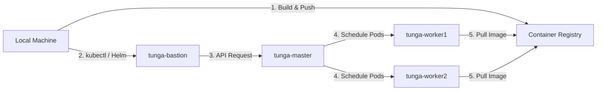

# Lab Infrastructure

Multi-node Kubernetes cluster for testing, development, and production pattern simulation.

## Cluster Overview

4-node setup with bastion host security:

| Node | Role | CPU | RAM | Storage | IP |
|------|------|-----|-----|---------|-----|
| tunga-bastion | jump host | Core 2 Duo | 2GB | 121GB | 192.168.0.105 |
| tunga-master | control-plane | i5 (8 cores) | 16GB | 240GB | 192.168.0.100 |
| tunga-worker1 | worker | i5 (2 cores) | 4GB | 500GB | 192.168.0.101 |
| tunga-worker2 | worker | i3 (2 cores) | 4GB | 300GB | 192.168.0.102 |

## Tech Stack

- **OS**: Ubuntu 24.04 LTS Server
- **Container Runtime**: containerd (K3s built-in)
- **Orchestration**: K3s v1.31.3
- **Monitoring**: Prometheus + Grafana
- **Network**: Flannel (K3s default)
- **Security**: SSH bastion host, UFW firewall

## Features

- Production-style bastion host (SSH access via jump server only)
- Multi-node pod scheduling with resource constraints
- Self-healing demonstrated (node failure recovery)
- Persistent volume support (local-path provisioner)
- Metrics collection and visualization
- Headless operation (lid-close disabled on laptops)

## Deployment Flow

The following diagram illustrates how applications are deployed to the cluster, from the local machine to the final running pods through the bastion host.

## Deployment Strategy

- **Resource Limits**: All deployments must define CPU/Memory requests and limits to ensure stability on worker nodes.
- **Access Control**: Deployment commands are routed through the bastion jump host for security audit.
- **Storage**: Stateful applications utilize the local-path provisioner for persistent data.

## Documentation

- [Architecture](docs/architecture.md) - Network topology, HA design, specifications
- [Setup](docs/setup.md) - Installation steps, configuration, troubleshooting
- [Ansible Documentation](docs/ansible.md) - Detailed automation and recovery steps
- [Backup & Restore](docs/backup-restore.md) - Detailed backup and recovery strategies, steps and commands
- [Design Decisions](docs/design-decisions.md) - Detailed backup and recovery strategies, steps and commands

## Stats

- **Uptime**: Cluster operational since Nov 2025
- **Pods Running**: ~11 (system + workloads)
- **Resource Utilization**: CPU 5-10%, Memory 15-20%