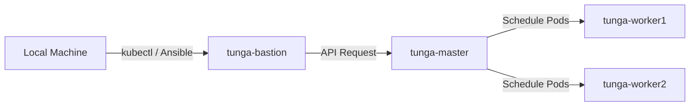

# Lab Infrastructure

Multi-node Kubernetes cluster for testing, development, and production pattern simulation.

## Cluster Overview

4-node setup with bastion host security:

| Node | Role | CPU | RAM | Storage | IP |
|------|------|-----|-----|---------|-----|
| tunga-bastion | jump host | Core 2 Duo | 2GB | 121GB | 192.168.0.105 |
| tunga-master | control-plane | i5 (8 cores) | 16GB | 240GB | 192.168.0.100 |
| tunga-worker1 | worker | i5 (2 cores) | 4GB | 500GB | 192.168.0.101 |
| tunga-worker2 | worker | i3 (2 cores) | 4GB | 300GB | 192.168.0.102 |

## Tech Stack

- **OS**: Ubuntu 24.04 LTS Server
- **Container Runtime**: containerd (K3s built-in)
- **Orchestration**: K3s v1.35.1
- **CNI**: Calico v3.29.1 (VXLAN encapsulation, network policies)
- **Load Balancer**: MetalLB v0.14.9 (IP pool: 192.168.0.200-210)
- **Ingress**: Envoy Gateway v1.7.0 (Gateway API v1.4.1)
- **TLS**: cert-manager v1.19.1 (Let's Encrypt DNS-01 via Cloudflare)
- **Monitoring**: Prometheus + Grafana (kube-prometheus-stack)
- **Security**: SSH bastion host, UFW firewall
- **IaC**: Ansible (full stack automation)

## Features

- Production-style bastion host (SSH access via jump server only)
- Multi-node pod scheduling with resource constraints
- Self-healing demonstrated (node failure recovery)
- Persistent volume support (local-path provisioner)
- Bare-metal load balancing via MetalLB
- Modern ingress via Gateway API (Ingress NGINX retired March 2026)
- Automated TLS certificate management with Let's Encrypt
- Metrics collection and visualization
- Headless operation (lid-close disabled on laptops)
- Full cluster rebuild via Ansible (~30 minutes from bare OS)

## Deployment Flow



## Traffic Flow (Inbound)

```
Internet → Cloudflare DNS → Router (port forward 80/443)
→ MetalLB (L2, 192.168.0.200) → Envoy Gateway
→ HTTPRoute → Application Service → Application Pods
```

TLS certificates issued automatically via cert-manager (Let's Encrypt DNS-01 challenge through Cloudflare API).

## Ansible Playbooks

| Playbook | Purpose |
|----------|---------|
| `bootstrap.yml` | One-time passwordless sudo setup |
| `setup_cluster.yml` | Full cluster deployment (CNI, LB, Gateway) |
| `deploy_gateway.yml` | Gateway API CRDs + Envoy Gateway |
| `deploy_cert_manager.yml` | cert-manager installation |
| `deploy_cluster_issuer.yml` | Cloudflare DNS-01 ClusterIssuer |
| `deploy_monitoring.yml` | Prometheus + Grafana stack |

## Deployment Strategy

- **Resource Limits**: All deployments define CPU/Memory requests and limits
- **Access Control**: Deployment commands routed through bastion jump host
- **Storage**: Stateful applications use local-path provisioner for persistent data
- **TLS**: Automatic certificate issuance and renewal via cert-manager
- **Networking**: Calico CNI with UFW firewall rules per component

## Documentation

- [Architecture](docs/architecture.md) - Network topology, traffic flow, specifications
- [Setup](docs/setup.md) - Installation steps, configuration, troubleshooting
- [Ansible Documentation](docs/ansible.md) - Automation, roles, disaster recovery
- [Backup & Restore](docs/backup-restore.md) - Backup strategies and recovery steps
- [Design Decisions](docs/design-decisions.md) - Rationale behind technology choices

## Stats

- **Uptime**: Cluster operational since Nov 2025
- **Pods Running**: ~25 (system + monitoring)
- **Resource Utilization**: CPU 10-20%, Memory 30-40%
- **Rebuild Time**: ~30 minutes from bare Ubuntu install