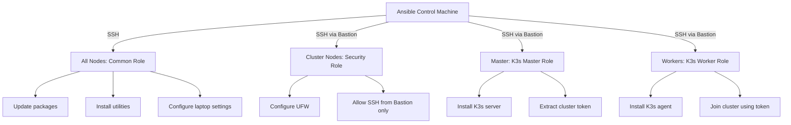

# Cluster Automation & Disaster Recovery

Complete Infrastructure as Code implementation for reproducible cluster deployment.

## Directory Structure
```
ansible/
├── bootstrap.yml        # Initial setup (passwordless sudo)
├── setup_cluster.yml    # Main cluster deployment
├── inventory.ini        # Node definitions and groups
├── group_vars/
│   └── all.yml         # Global variables (versions, network config)
└── roles/
    ├── common/         # Base configuration for all nodes
    │   ├── defaults/main.yml    # Package lists, timeout values
    │   ├── handlers/main.yml    # Service restart triggers
    │   └── tasks/main.yml       # OS updates, packages, laptop settings
    ├── k3s_master/     # Control plane initialization
    │   └── tasks/main.yml       # K3s server install, token extraction
    ├── k3s_worker/     # Worker node configuration
    │   └── tasks/main.yml       # K3s agent join
    ├── monitoring/     # Observability stack
    │   └── tasks/main.yml       # Prometheus + Grafana via Helm
    └── security/       # Infrastructure hardening
        └── tasks/main.yml       # UFW firewall, SSH restrictions
```

## Prerequisites

- **OS**: Ubuntu 24.04 LTS Server (fresh install)
- **User**: `ubuntu` user with sudo privileges on all nodes
- **SSH**: Public key authentication configured
- **Network**: All nodes reachable via IPs in inventory
- **Ansible**: Version 2.9+ on control machine

## Initial Setup (One-Time Bootstrap)

### Step 1: Add SSH Keys
```bash
# Copy your SSH key to all nodes
ssh-copy-id ubuntu@192.168.0.105  # bastion
ssh-copy-id ubuntu@192.168.0.100  # master
ssh-copy-id ubuntu@192.168.0.101  # worker1
ssh-copy-id ubuntu@192.168.0.102  # worker2
```

### Step 2: Bootstrap Passwordless Sudo

**Why:** Ansible requires passwordless sudo for automation. This one-time setup configures it.
```bash
cd ansible/
ansible-playbook -i inventory.ini bootstrap.yml --ask-become-pass
# Enter ubuntu user's sudo password when prompted
```

**What it does:**
- Creates `/etc/sudoers.d/ubuntu` with `NOPASSWD:ALL`
- Validates sudoers file syntax
- Ensures ubuntu user in sudo group

**Verification:**
```bash
# Run again - should show "ok" (no changes)
ansible-playbook -i inventory.ini bootstrap.yml --ask-become-pass
```

### Step 3: Deploy Cluster
```bash
ansible-playbook -i inventory.ini setup_cluster.yml
# No password needed - runs fully automated
```

## Automation Architecture

### Execution Flow


### Role Responsibilities

**common** (Applied to all nodes):
- System package updates (`apt update && apt upgrade`)
- Essential package installation (curl, vim, git, python3, etc.)
- Laptop-specific settings (lid-close behavior, GRUB console timeout)

**security** (Applied to cluster nodes):
- UFW firewall reset and configuration
- Default deny (incoming) / allow (outgoing)
- SSH access restricted to bastion host (192.168.0.105)
- K3s/Kubelet/Flannel ports restricted to trusted subnet
- SSH daemon hardening (no password auth, no root login)

**k3s_master** (Applied to master node):
- K3s server installation with cluster-init
- Traefik disabled (custom ingress later)
- Node token extraction for worker join
- Token exposed as Ansible fact for workers

**k3s_worker** (Applied to worker nodes):
- K3s agent installation
- Cluster join using master token
- Idempotent (skips if already joined)

**monitoring** (Optional, manual trigger):
- Helm repository configuration
- kube-prometheus-stack deployment
- Grafana admin password retrieval

## Idempotency

All playbooks are **idempotent** - safe to run multiple times:

**First run:**
```
changed: [tunga-master]  # Changes applied
changed: [tunga-worker1]
```

**Second run:**
```
ok: [tunga-master]  # Already configured, no changes
ok: [tunga-worker1]
```

**Benefits:**
- Safe to re-run after failures
- Converges to desired state
- No duplicate configurations

## Parallel Execution

Ansible runs tasks on **multiple nodes simultaneously** (default: 5 concurrent).
```
Task: Update packages
├─ tunga-bastion  ━━━━━━━━━━ 10 min
├─ tunga-master   ━━━━━━━━━━ 10 min
├─ tunga-worker1  ━━━━━━━━━━ 10 min
└─ tunga-worker2  ━━━━━━━━━━ 10 min
Total time: ~10 minutes (not 40!)
```

Configure in `ansible.cfg`:
```ini
[defaults]
forks = 5  # Concurrent nodes
```

## Disaster Recovery Procedure

### Scenario: Node Failure

A node has crashed and requires fresh OS installation.

### Step 1: OS Installation

1. Boot from Ubuntu 24.04 USB
2. Install Ubuntu Server
3. Create `ubuntu` user during installation
4. Configure static IP

### Step 2: Network Verification
```bash
# From your laptop:
ping 192.168.0.101  # Verify node is reachable

# SSH test:
ssh ubuntu@192.168.0.101
```

### Step 3: Bootstrap (One-Time)
```bash
cd ansible/

# Configure passwordless sudo on new node
ansible-playbook -i inventory.ini bootstrap.yml --ask-become-pass --limit tunga-worker1
```

**Note:** `--limit` targets only the new node, skips others.

### Step 4: Deploy Cluster Configuration
```bash
# Deploy full cluster config
ansible-playbook -i inventory.ini setup_cluster.yml

# Or target only the new node:
ansible-playbook -i inventory.ini setup_cluster.yml --limit tunga-worker1
```

**What happens:**
- Existing nodes: `ok` (no changes)
- New node: `changed` (K3s agent installed, joined cluster)

### Step 5: Verify
```bash
# Check cluster status:
ssh tunga-master
kubectl get nodes

# Expected output:
NAME            STATUS   ROLES                AGE
tunga-master    Ready    control-plane,etcd   30d
tunga-worker1   Ready    <none>               1m   ← New node
tunga-worker2   Ready    <none>               30d
```

## Complete Cluster Rebuild

### Scenario: Rebuild entire cluster from scratch
```bash
# 1. Install Ubuntu 24.04 on all 4 nodes

# 2. Verify network connectivity
ansible all -i inventory.ini -m ping

# 3. Bootstrap all nodes
ansible-playbook -i inventory.ini bootstrap.yml --ask-become-pass

# 4. Deploy cluster
ansible-playbook -i inventory.ini setup_cluster.yml

# 5. Verify cluster
ssh tunga-master
kubectl get nodes
```

**Time:** ~30-45 minutes for complete rebuild (including OS installation).

## Development & Validation Workflow

### 1. Linting

Check playbooks for best practices and potential issues:
```bash
ansible-lint setup_cluster.yml
ansible-lint bootstrap.yml
```

### 2. Dry Run (Check Mode)

See what would change **without applying**:
```bash
ansible-playbook -i inventory.ini setup_cluster.yml --check
```

**Output example:**
```
TASK [common : Update packages]
changed: [tunga-worker1]  ← Would update packages

TASK [k3s_worker : Join cluster]
ok: [tunga-worker1]  ← Already joined, no change
```

### 3. Diff Mode

Show exact file changes:
```bash
ansible-playbook -i inventory.ini setup_cluster.yml --check --diff
```

### 4. Limit Execution

Target specific nodes or groups:
```bash
# Single node:
ansible-playbook -i inventory.ini setup_cluster.yml --limit tunga-worker1

# Node group:
ansible-playbook -i inventory.ini setup_cluster.yml --limit workers

# Multiple nodes:
ansible-playbook -i inventory.ini setup_cluster.yml --limit tunga-worker1,tunga-worker2
```

### 5. Tag-Based Execution

Run specific tasks (if tags configured):
```bash
# Example: Only run security tasks
ansible-playbook -i inventory.ini setup_cluster.yml --tags security

# Skip specific tasks
ansible-playbook -i inventory.ini setup_cluster.yml --skip-tags upgrade
```

## Troubleshooting

### Connection Issues
```bash
# Test connectivity:
ansible all -i inventory.ini -m ping

# Verbose output (-vvv for more detail):
ansible-playbook -i inventory.ini setup_cluster.yml -v
```

### Sudo Password Issues
```bash
# If passwordless sudo breaks:
ansible-playbook -i inventory.ini bootstrap.yml --ask-become-pass

# Or manually fix on node:
ssh ubuntu@<node-ip>
echo "ubuntu ALL=(ALL) NOPASSWD:ALL" | sudo tee /etc/sudoers.d/ubuntu
sudo chmod 440 /etc/sudoers.d/ubuntu
```

### Playbook Failures
```bash
# Resume from last failed task:
ansible-playbook -i inventory.ini setup_cluster.yml --start-at-task="Install K3s Server"

# Force handlers to run:
ansible-playbook -i inventory.ini setup_cluster.yml --force-handlers
```

### K3s Installation Issues
```bash
# Check if K3s is already installed:
ssh tunga-master
systemctl status k3s

# Manual reinstall if needed:
curl -sfL https://get.k3s.io | sh -s - server --cluster-init
```

## Best Practices

1. **Always test with --check first** before applying changes
2. **Use version control** for playbook changes (Git)
3. **Document custom variables** in group_vars/all.yml
4. **Keep bootstrap.yml separate** from main playbook
5. **Use --limit for single-node changes** to avoid unnecessary runs
6. **Run lint before committing** playbook changes
7. **Backup cluster state** before major changes (etcd snapshots)