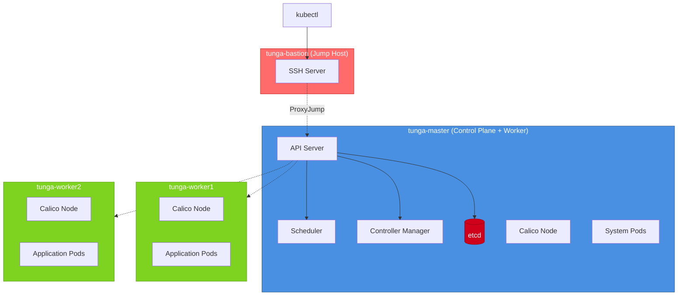
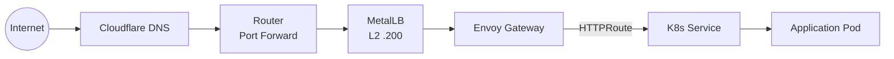

# Architecture

## Network Topology

```mermaid
graph TB
    Internet((Internet))
    Cloudflare[Cloudflare DNS
    Router[Router<br/>192.168.0.1]
    Bastion[tunga-bastion<br/>192.168.0.105<br/>2GB RAM, 121GB SSD<br/>SSH Jump Host]
    Master[tunga-master<br/>192.168.0.100<br/>16GB RAM, 240GB SSD]
    W1[tunga-worker1<br/>192.168.0.101<br/>4GB RAM, 500GB SSD]
    W2[tunga-worker2<br/>192.168.0.102<br/>4GB RAM, 300GB SSD]
    MetalLB[MetalLB<br/>192.168.0.200-210]

    Internet --> Cloudflare
    Cloudflare --> Router
    Router -->|Port forward 80/443| MetalLB
    MetalLB --> Master
    MetalLB --> W1
    MetalLB --> W2

    Router --- Bastion
    Bastion --> Master
    Bastion --> W1
    Bastion --> W2

    style Bastion fill:#ff6b6b,stroke:#c92a2a,color:#fff
    style Master fill:#4a90e2,stroke:#2e5c8a,color:#fff
    style W1 fill:#7ed321,stroke:#5fa319,color:#fff
    style W2 fill:#7ed321,stroke:#5fa319,color:#fff
    style Router fill:#f5a623,stroke:#d68910,color:#fff
    style MetalLB fill:#9b59b6,stroke:#6c3483,color:#fff
```

**Subnet**: 192.168.0.0/24
**Gateway**: 192.168.0.1
**DNS**: 8.8.8.8, 1.1.1.1
**MetalLB IP Pool**: 192.168.0.200-192.168.0.210

**Security**: Master and worker nodes accept SSH only from bastion (192.168.0.105)

## Node Specifications

### tunga-bastion (Jump Host)
- **Hardware**: MacBook Air A1466 (2010)
- **CPU**: Intel Core 2 Duo (2 cores @ 1.86GHz)
- **RAM**: 2GB
- **Storage**: 121GB
- **Network**: WiFi 802.11n
- **Role**: SSH bastion host, secure gateway to cluster
- **Services**: SSH jump server

### tunga-master (Control Plane + Worker)
- **Hardware**: MacBook Pro A1278
- **CPU**: Intel Core i5 (8 cores @ 2.5GHz)
- **RAM**: 16GB
- **Storage**: 240GB
- **Network**: WiFi 802.11n
- **Role**: K3s server, etcd, scheduler, controller-manager
- **Workload**: System pods + application pods
- **SSH Access**: Via bastion only

### tunga-worker1
- **Hardware**: i5 Laptop
- **CPU**: Intel Core i5-3210M (2 cores @ 2.5GHz)
- **RAM**: 4GB
- **Storage**: 500GB
- **Network**: WiFi 802.11n
- **Role**: K3s agent
- **Workload**: Application pods
- **SSH Access**: Via bastion only

### tunga-worker2
- **Hardware**: i3 Laptop
- **CPU**: Intel Core i3 (2 cores)
- **RAM**: 4GB
- **Storage**: 300GB
- **Network**: WiFi 802.11n
- **Role**: K3s agent
- **Workload**: Application pods
- **SSH Access**: Via bastion only

## Security Design

### SSH Bastion Pattern

Production-style security with jump host:
```
Local Machine → tunga-bastion → tunga-master/workers
                (only entry point)
```

**Access Flow:**
1. Direct SSH to bastion (192.168.0.105)
2. From bastion, SSH to master/workers
3. Or use ProxyJump for transparent access from local machine

**Firewall Rules (UFW):**
- Master/Workers: Allow SSH only from 192.168.0.105 (bastion)
- K3s API (6443), Kubelet (10250): Restricted to trusted subnet
- Calico VXLAN (4789/udp), BGP (179/tcp): Restricted to trusted subnet
- MetalLB: L2 advertisement on local network

### Production Comparison

| Aspect | Home Lab | Production |
|--------|----------|------------|
| Control Plane | 1 node | 3+ nodes (etcd quorum) |
| Load Balancer | MetalLB (L2) | Cloud LB / HAProxy |
| CNI | Calico VXLAN | Calico BGP / Cilium |
| Ingress | Envoy Gateway | Envoy Gateway / Istio |
| TLS | cert-manager (Let's Encrypt) | cert-manager (Let's Encrypt) |
| Storage | local-path | Ceph / NFS / Cloud PV |
| Acceptable Downtime | Minutes | < 1 second |

## Cluster Architecture



## Inbound Traffic Flow



**TLS Termination**: Envoy Gateway terminates TLS using certificates managed by cert-manager. Certificates are issued by Let's Encrypt via DNS-01 challenge (Cloudflare API).

## Networking Stack

### CNI: Calico v3.29.1

- **Encapsulation**: VXLANCrossSubnet (VXLAN within subnet, BGP-ready)
- **Pod CIDR**: 10.42.0.0/16 (K3s default)
- **Node allocation**: /26 blocks per node
- **Network policies**: Supported

Node CIDR allocation:
- `10.42.0.0/26` → tunga-master
- `10.42.1.0/26` → tunga-worker1
- `10.42.2.0/26` → tunga-worker2

### Load Balancer: MetalLB v0.14.9

- **Mode**: L2 (ARP-based)
- **IP Pool**: 192.168.0.200-192.168.0.210
- **Use**: Assigns external IPs to LoadBalancer-type Services

### Ingress: Envoy Gateway v1.7.0

- **Gateway API version**: v1.4.1 (Standard channel)
- **GatewayClass**: `envoy`
- **Namespace**: envoy-gateway-system
- **Replaces**: Ingress NGINX (retired March 2026)

### TLS: cert-manager v1.19.1

- **Issuer**: Let's Encrypt (production)
- **Challenge type**: DNS-01
- **DNS provider**: Cloudflare API
- **ClusterIssuer**: letsencrypt-prod

## Service Discovery

- **DNS**: CoreDNS (cluster.local domain)
- **Service CIDR**: 10.43.0.0/16
- **Service Types**: ClusterIP, LoadBalancer

## Storage

- **Provisioner**: local-path (K3s built-in)
- **StorageClass**: local-path (default)
- **Volumes**: Hostpath-backed persistent volumes

## Resource Allocation

All pods are scheduled with resource requests and limits:
```yaml
resources:
  requests:
    memory: "128Mi"
    cpu: "100m"
  limits:
    memory: "256Mi"
    cpu: "200m"
```