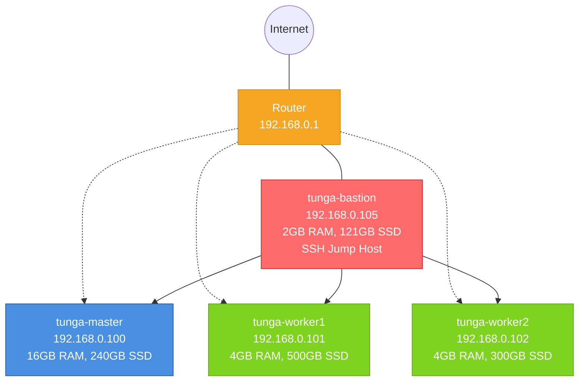
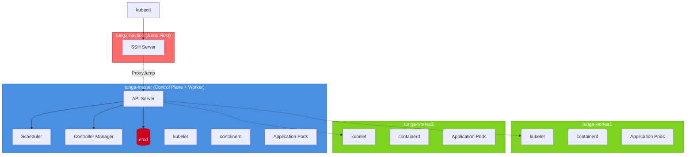

# Architecture

## Network Topology


**Subnet**: 192.168.0.0/24  
**Gateway**: 192.168.0.1  
**DNS**: 8.8.8.8, 1.1.1.1

**Security**: Master and worker nodes accept SSH only from bastion (192.168.0.105)

## Node Specifications

### tunga-bastion (Jump Host)
- **Hardware**: MacBook Air A1466 (2010)
- **CPU**: Intel Core 2 Duo (2 cores @ 1.86GHz)
- **RAM**: 2GB
- **Storage**: 121GB
- **Network**: WiFi 802.11n
- **Role**: SSH bastion host, secure gateway to cluster
- **Services**: SSH jump server

### tunga-master (Control Plane + Worker)
- **Hardware**: MacBook Pro A1278
- **CPU**: Intel Core i5 (8 cores @ 2.5GHz)
- **RAM**: 16GB
- **Storage**: 240GB
- **Network**: WiFi 802.11n
- **Role**: K3s server, etcd, scheduler, controller-manager
- **Workload**: System pods + application pods
- **SSH Access**: Via bastion only

### tunga-worker1
- **Hardware**: i5 Laptop
- **CPU**: Intel Core i5-3210M (2 cores @ 2.5GHz)
- **RAM**: 4GB
- **Storage**: 500GB
- **Network**: WiFi 802.11n
- **Role**: K3s agent
- **Workload**: Application pods
- **SSH Access**: Via bastion only

### tunga-worker2
- **Hardware**: i3 Laptop
- **CPU**: Intel Core i3 (2 cores)
- **RAM**: 4GB
- **Storage**: 300GB
- **Network**: WiFi 802.11n
- **Role**: K3s agent
- **Workload**: Application pods
- **SSH Access**: Via bastion only

## Security Design

### SSH Bastion Pattern

Production-style security with jump host:
```
Local Machine → tunga-bastion → tunga-master/workers
                (only entry point)
```

**Access Flow:**
1. Direct SSH to bastion (192.168.0.105)
2. From bastion, SSH to master/workers
3. Or use ProxyJump for transparent access

**Firewall Rules (UFW):**
- Master/Workers: Allow SSH only from 192.168.0.105
- Bastion: Allow SSH from any (192.168.0.0/24)

**Benefits:**
- Single point of access (audit trail)
- Hardened bastion host
- Production security pattern
- Reduced attack surface

### Production Comparison

| Aspect                | Home Lab          | Production |
|-----------------------|-------------------|-------------------------------|
| Control Plane         | 1 node            | 3+ nodes (etcd quorum)        |
| LoadBalancer          | None              | HAProxy/cloud LB              |
| etcd                  | Single instance   | Clustered (raft consensus)    |
| Acceptable Downtime   | Minutes           | < 1 second                    |

**Trade-offs:**
- Single master crash = control plane down (kubectl stops working)
- Worker pods continue running during master outage
- No new pod scheduling until master recovery
- Sufficient for development/testing workloads

## Cluster Architecture


## Pod Network (CNI)

**CIDR**: 10.42.0.0/16 (K3s default)  
**Implementation**: Flannel VXLAN

Node CIDR allocation:
- `10.42.0.0/24` → tunga-master
- `10.42.1.0/24` → tunga-worker1
- `10.42.2.0/24` → tunga-worker2

## Resource Allocation

Pods are scheduled with resource requests/limits:
```yaml
resources:
  requests:
    memory: "128Mi"
    cpu: "100m"
  limits:
    memory: "256Mi"
    cpu: "200m"
```

Scheduler distributes based on available resources across nodes.

## Service Discovery

- **DNS**: CoreDNS (cluster.local domain)
- **Service CIDR**: 10.43.0.0/16
- **Service Types**: ClusterIP, NodePort

## Storage

- **Provisioner**: local-path (K3s built-in)
- **StorageClass**: local-path (default)
- **Volumes**: Hostpath-backed persistent volumes